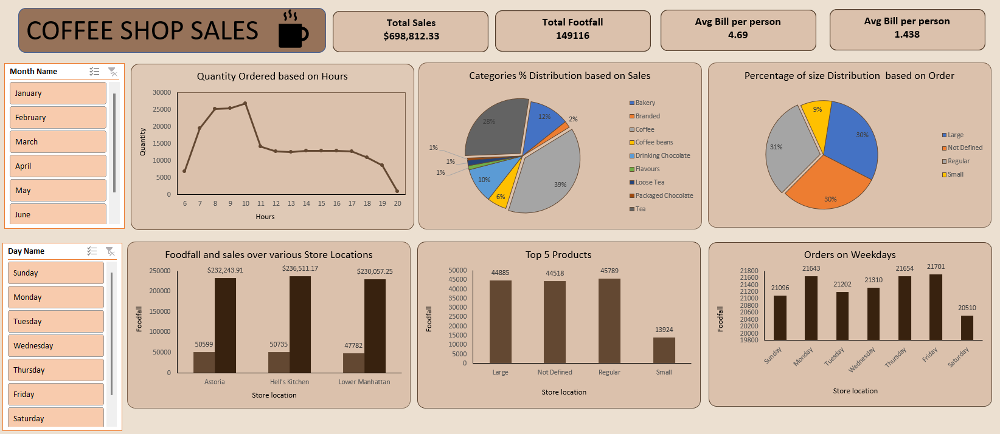

# ☕ Coffee Sales Dashboard (Excel Business Intelligence Project)

## 📌 Project Overview
The Coffee Sales Dashboard is an interactive Business Intelligence solution developed in Microsoft Excel to analyze transactional coffee sales data and extract actionable insights.

This project demonstrates end-to-end analytical workflow including data cleaning, transformation, KPI development, and dashboard visualization. The solution converts raw sales data into structured, decision-ready insights through dynamic Pivot Tables, Charts, and Slicers.

The dashboard is designed to simulate a real-world business reporting environment where stakeholders require quick, data-driven performance evaluation.

---

## 🎯 Business Objective
The primary objective of this project is to support strategic decision-making by:

- Monitoring overall sales performance
- Identifying top-performing products and categories
- Analyzing country-wise revenue distribution
- Tracking monthly and seasonal sales trends
- Understanding customer purchasing behavior
- Evaluating order patterns and contribution metrics

The dashboard enables management to assess performance at a glance without manually analyzing large datasets.

---

## 📊 Key Performance Indicators (KPIs)
The dashboard tracks essential business metrics including:

- Total Revenue
- Total Orders
- Average Order Value
- Country-wise Sales Contribution
- Monthly Revenue Growth
- Product Category Performance

These KPIs provide a comprehensive overview of operational and sales efficiency.

---

## ⚒️ Tools & Techniques Used
- Microsoft Excel
- Pivot Tables & Pivot Charts
- Slicers for Interactive Filtering
- Data Cleaning & Structuring
- Conditional Formatting
- KPI Calculations
- Data Aggregation & Summarization
- Dashboard UI/UX Design Principles

---

## 🖼 Dashboard Preview

---

## 📂 Dataset Description
The dataset consists of transaction-level coffee sales records containing:

- Order Date
- Product Name
- Product Category
- Country
- Sales Amount
- Customer Details
- Order Information

The data was pre-processed to remove inconsistencies, standardize formats, and ensure accurate aggregation for reporting.

---

## 📈 Key Insights Derived

- Identified the highest revenue-generating coffee products.
- Determined top-performing countries contributing maximum sales.
- Observed consistent monthly growth trends with seasonal fluctuations.
- Analyzed customer purchase frequency and order distribution.
- Evaluated category-level contribution to overall revenue.

These insights can support decisions related to:
- Inventory management
- Market expansion strategy
- Product promotion focus
- Revenue optimization planning

---

## 🚀 How to Use the Dashboard
1. Download the `coffee.xlsx` file from this repository.
2. Open the file in Microsoft Excel .
3. Navigate to the "Dashboard" worksheet.
4. Use slicers to filter data by country, product category, or time period.
5. Explore dynamic charts and KPI indicators for insights.

---

## 🧠 Analytical Skills Demonstrated
- Exploratory Data Analysis (EDA)
- Business Intelligence Reporting
- KPI Identification & Tracking
- Data Visualization & Storytelling
- Problem-Solving & Analytical Thinking
- Dashboard Structuring & Layout Optimization

## 📌 Project Impact
This project showcases the ability to transform raw transactional data into meaningful, decision-support insights using structured Excel-based analytics.
It reflects practical, industry-relevant skills applicable to roles such as:

- Data Analyst
- Business Intelligence Analyst
- Sales Analyst
- Operations Analyst
- MIS Executive

---

## 📈 Future Improvements
- Integration with Power BI for advanced visualization
- Automation using Power Query
- Advanced forecasting using Excel’s What-If Analysis tools
- Customer segmentation analysis

